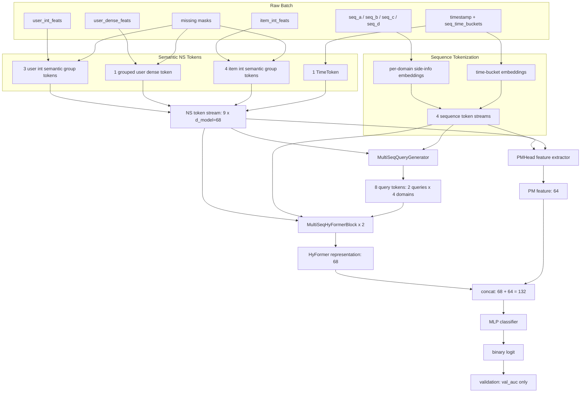

# hyformer_pm_head_semantic_feature_v1 Architecture

## Current Run Configuration

- `ns_tokenizer_type=group`
- `d_model=68`
- `num_queries=2`
- `num_hyformer_blocks=2`
- `num_heads=4`
- `pm_head_enabled=True`
- `pm_feature_dim=64`
- `time_token_enabled=True`
- `rankmixer_input_tokens = 2 * 4 + 9 = 17`
- `classifier_input_dim = 68 + 64 = 132`
